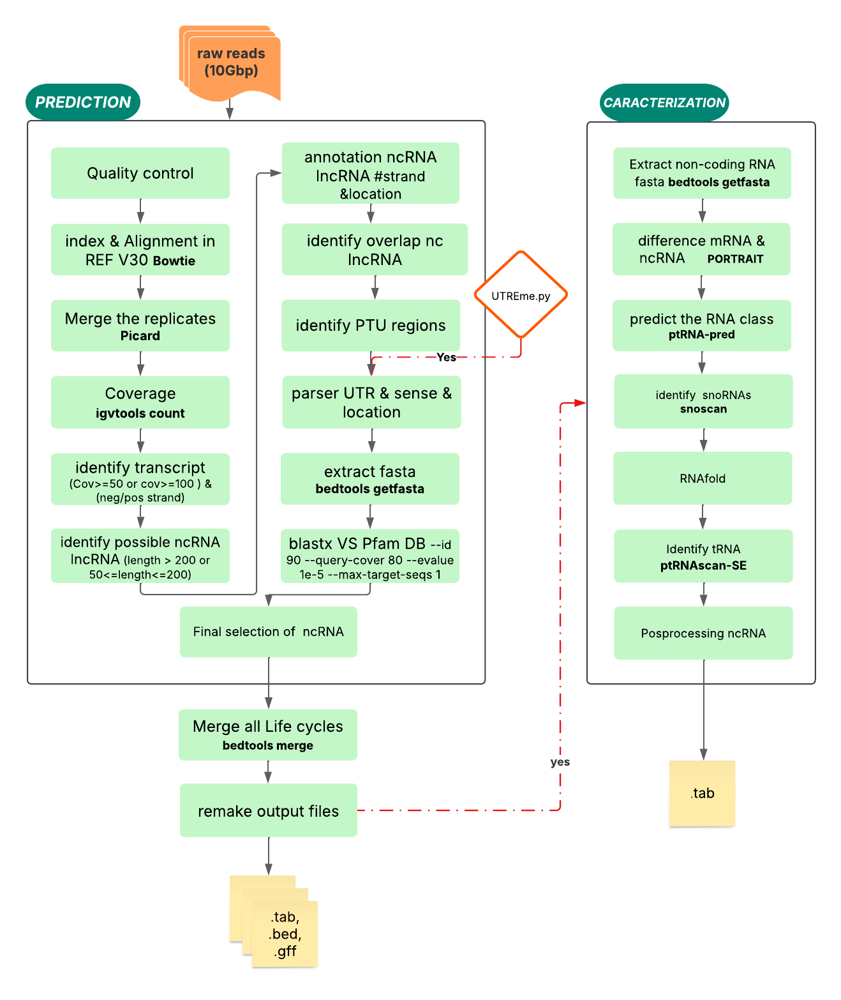

# TriTry-ncRNA

TriTry-ncRNA is a pipeline in order to identify putative non-coding RNAs in Trypanosomatids organisms by analyzing transcripts derived from RNA-seq data. This tool initiates its process by detecting the set of transcripts mapped from sequencing the total RNA of the three life stages of Leishmania braziliensis: procyclic promastigote (PRO), metacyclic promastigote (META), and amastigote (AMA).



 Workflow-TriTryp-ncRNA.png

## Introduction
* 2_identify_transcript.py: Identify in all chromossomal positions the coverage >= 50x or 100x reads for strand + & - strand.
* 3_identify_possible_ncRNA_lncRNA.py: Identify lnc-RNA (>200pb) with >= 50x cov and snc-RNA (<200 pb) with >= 100x cov.
* 4_annotation_ncRNA_lncRNA.py: Identify the location of non-coding RNA in coding or intergenic regions. 
* 5_identify_overlap_nc-lncRNA.py: Identify the snc-RNA overlapping lnc-RNA.
* 6_identify_ptu.py: To identify: PTU regions.
* 7_parser_UTR_sense_antisense.py: Add information of sense of non-coding RNA in relation from PTUs and UTR regions.
* 8_select_ncrna.py: Final selection by directory.
* 9_remake_output.py: Create gff, tab and bed format output files.
* 10_postprocessing_ncrna.py : complement with characterization of non-coding RNA


The pipeline process all the python code by directory, each directory can represent a life cycle, that contain the biological repetions in fastq format (*_1/2.fastq.gz) and a size of aproximately 72 Mpb (~5 Gb) dependent on therholds 50x and 100x.
 Posteriolly this are merge for all total non-coding RNAs.

## Input files
TriTry-ncRNA users should have the following minimal input files:
- lisdir.txt (-dir_list) : File contain a list of
 directories path that contain all fastq files.
- genome.fasta (-fasta): Reference genome FASTA file.
- genome.gff (-gff): Annotation GFF file.

## Instalation and requirements
The following software and libraries must be installed on your machine:
* Fastqc
* Bowtie2 
* Samtools
* Picard
* Bedtools
* Diamond
* Python3
* Pfam Database
* portrait-1.1 (optional)
* ptRNApred1.0 (optional)
* tRNAscan-SE (optional)


## Installation
Clone the TriTry-ncRNA git:
```
git clone https://github.com/AKCLAB/TriTry-ncRNA.git
```

Go to scripts directory
```
cd TriTry-ncRNA
```

## Invoking TriTry-ncRNA
```
 bash pipe_ncrna.sh -dir_list <file> -output <path> -db <path> -threads <number> -reffasta <file> -refgff <file> -utr5 <file> -utr3 <file> -dir_tool <path>
```

## Test with example:
```
cd scripts/

bash pipe_ncrna.sh -dir_list /path/to/TriTry-ncRNA/test/listdir.txt -output /path/to/TriTry-ncRNA/test -db /path/to/TriTry-ncRNA/db -threads 20 -reffasta /path/to/TriTry-ncRNA/test/TriTrypDB-30_LbraziliensisMHOMBR75M2903_Genome.fasta -refgff /path/to/TriTry-ncRNA/test/TriTrypDB-30_LbraziliensisMHOMBR75M2903.gff -utr5 /path/to/TriTry-ncRNA/test/UTRme_fiveutr.tsv -utr3 /path/to/TriTry-ncRNA/TriTry-ncRNA/test/UTRme_threeutr.tsv -dir_tool /path/to/program

```


## Output Files


## Command line options


